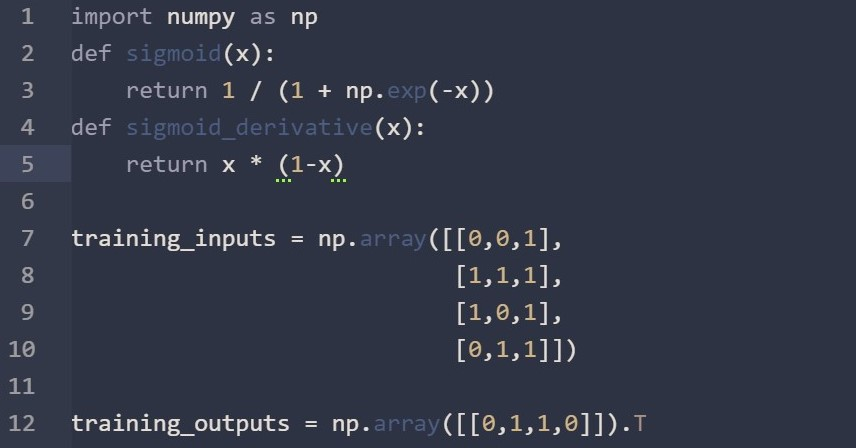

# céüse-syntax theme

An Atom syntax theme inspired by the beautiful cliffs of Céüse, France. An example of the syntax and a photograph of Sébastien Bouin climbing Biographie at Céüse can be seen below.

  
   
  

